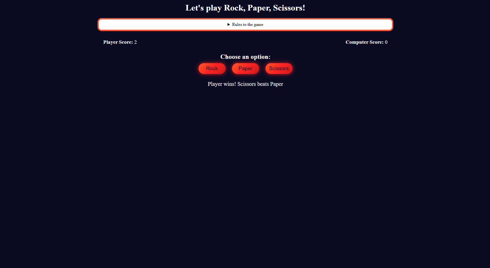
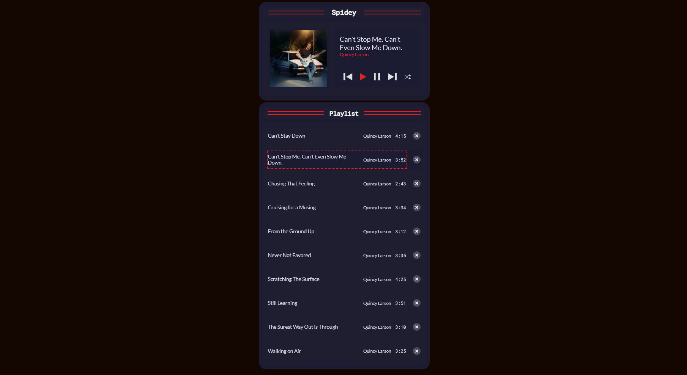
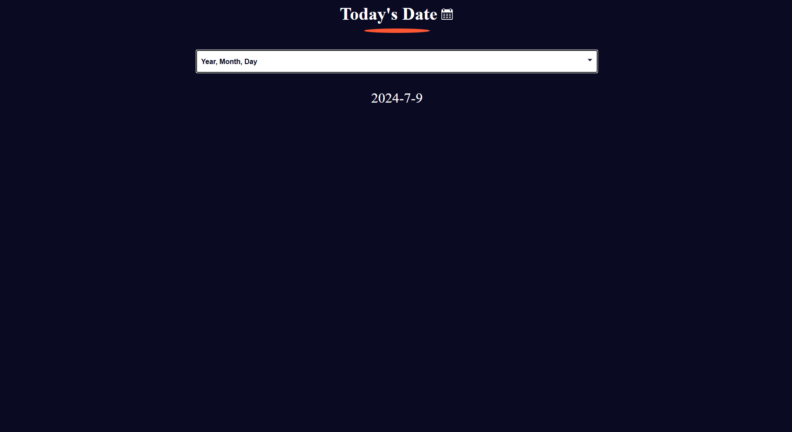
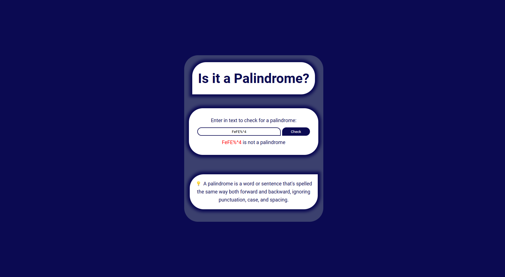
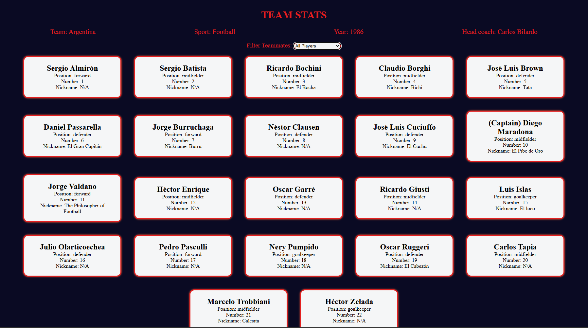

# JavaScript Projects Repository 🚀

Welcome to the JavaScript Projects repository! 🎉 This collection showcases various JavaScript projects I have developed while learning and honing my JavaScript skills.

## Projects

### 1. Calorie Counter


A simple application to help you track your daily calorie intake.

### 2. Rock Paper Scissors Game


A fun and interactive Rock Paper Scissors game to play against the computer.

### 3. Music Player


An elegant music player to play your favorite songs.

### 4. Date Formatter


A utility to format dates into various formats.

### 5. Palindrome Checker


A tool to check if a given word or phrase is a palindrome.

### 6. Football-Team Cards


A project showcasing football team cards with relevant details.

### 7. ToDo App


A simple and effective ToDo application to manage your tasks.

### 8. Decimal To Binary Converter

A converter to easily transform decimal numbers into binary.

---

## How to Use

Feel free to explore each project and see the code behind them. Contributions and feedback are always welcome! 🗂️

### How to Run the Projects

1. Clone this repository:
   ```sh
   git clone https://github.com/peter-kibet/JavaScript-Projects.git
2. Navigate to the project directory:
   ```sh
   ```cd JavaScript-Projects

3. Open the project files in your preferred code editor.
4. Open the HTML files in your browser to see the projects in action.

## Contributions

If you have any suggestions or improvements, feel free to open an issue or submit a pull request. Let’s learn and grow together! 🌱🤝

## License
This repository is licensed under the MIT License. See the -[LICENSE](./LICENSE) file for more information.

## Connect with Me

-[LinkedIn](https://www.linkedin.com/in/peter-kibet/)
-[Twitter](https://twitter.com/peter)
-[GitHub](www.github.com/peter-kibet)
-[Blog](https://peterkibet.com)

Thank you for visiting my JavaScript Projects repository. I hope you find these projects interesting and useful! 🌟

Happy Coding! 🚀